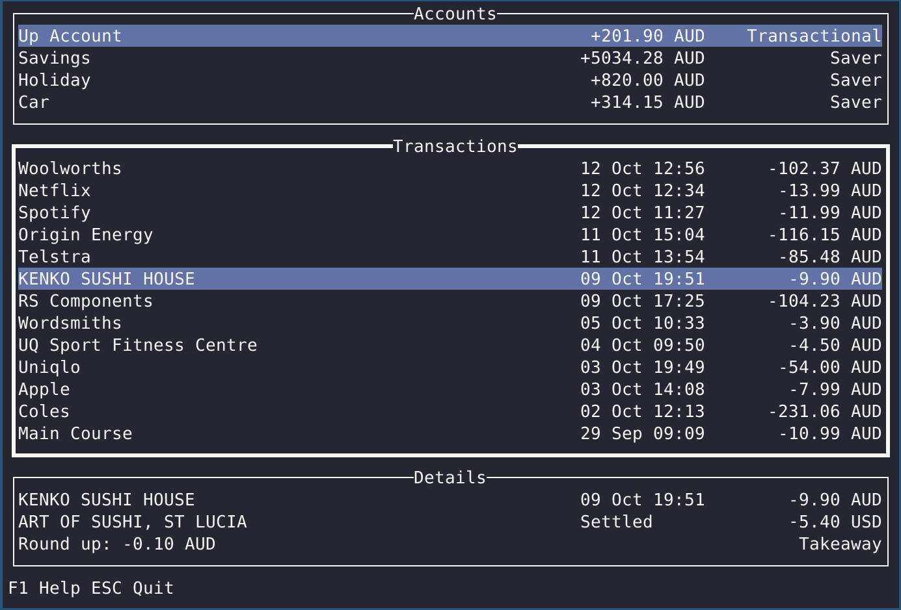
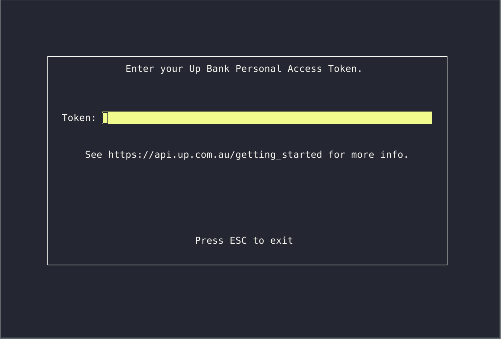

uptop 🙌
==============

`uptop` is a terminal client for Up Bank ⚡ written in Haskell.

Powered by the [Up Bank API](https://developer.up.com.au/), [brick](https://github.com/jtdaugherty/brick/) and [servant](servant.dev).



## Usage

Start `uptop` with the `UP_BANK_TOKEN` environment variable, or choose to enter it later.



## API Client Usage


Check out [`src/Demo.hs`](src/Demo.hs) for an example program and [`src/Up/API.hs`](src/Up/API.hs) to see
the implemented client functions.

```bash
$ git clone https://github.com/ldgrp/up-bank-hs.git
$ cd up-bank-hs
$ UP_BANK_TOKEN=up:yeah:TOKEN cabal run
```

`Demo.hs` expects an `UP_BANK_TOKEN` environemnt variable. Get your personal
access token [here](https://api.up.com.au/getting_started).

All client functions `f` which return paginated responses `ClientM (Paginated a)` 
have an unpaginated version `f_` which will `unfold` the paginated response to a 
list `ClientM [a]`.

```Haskell
run :: IO ()
run = do
    -- Retrieve the full list of transactions across all accounts.
    res <- query (listTransactions_ Nothing Nothing Nothing Nothing)
    BLC.putStrLn $ encodePretty res
      
main :: IO ()
main = run
```

### Todo
- [x] Accounts
- [x] Categories
- [x] Tags
- [x] Transactions
- [ ] Webhooks
- [ ] Brick TUI (Work in progress)
- [ ] CLI
